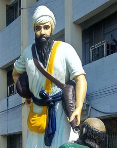
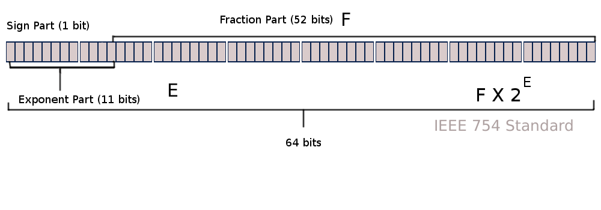

<link rel="stylesheet" href="css/theme/mandeep.css" id="theme">
<section data-background="images/wel.jpg">
>##welcome <br/>to
>#*Robotic* vision

---

>###*Digital* Images 

Digital image is a numeric representation of a two-dimensional image. Depending on whether the image resolution is fixed, it may be of vector or raster type. By itself, the term <span style="color:red;">digital image</span> usually refers to raster images or bitmapped images.

---

>###*Image* formats

Type | File extension | Description | 
-----|----------------|------------
JPEG |.jpg .jpeg      |Joint photographic Expert Group
TIFF |.tif .tiff      |Tagged Image File Format
GIF  |.gif            |Graphic Interchange Format
PNG  |.png            |Portable Network Graphics
BMP  |.bmp            |BitMap Format
PGM  |.pgm            |Portable GrayMap format

---

<section data-background="images/gr1.png">
>###Image *file formats*


---

>###Image *file formats*

<ul>
<li class="fragment"> There are different formats, as well as different compression methods.</li>
<li class="fragment"> JPEG image file is correctly.
<ul>
    <li class="fragment"> an EXIF container</li>
    <li class="fragment"> holding JPEG compressed image data</li>
</ul></li>
</ul>

---

>###image *compression*

<section data-background="images/10.png">

---

<section data-background="images/c1.png">

---

<section data-background="images/c2.png">

---

<section data-background="images/c3.png">

---

<section data-background="images/c4.png">
    

---


>###Image *compression*

<ul>
	<li class="fragment"> Lots of pixel in an image
            <ul><li class="fragment"> we want to make the file size smaller</li>	    </ul></li>
<li class="fragment"> Lossless
  <ul>
	<li class="fragment"> exploits redundecy in the image</li></ul></li>
<li class="fragment"> Lossy
  <ul>
	<li class="fragment"> exploits limitation in the human vision system
    		<ul><li class="fragment">do not notice very detail</li>
    		    <li class="fragment"> color resolution much less than intensity resolution</li>
    		    <li class="fragment"> color sensitivity depends on color</lli>
</ul></li></ul></li>

---

<section data-background="images/getting.jpg">

>###getting *images* into Programming environment

```
>import cv2
>img=cv2.imread('gne.jpg') 
>cv2.imshow('image',img) 
>cv2.waitKey(0) 
>cv2.destroyAllWindows()

```
<div class="fragment"></div> 


---


>###Unsigned 8-bit integer *(uint8)*

 

* Smallest value is 00000000<sub>2</sub> or 0<sub>10</sub>
* Largest value is 11111111<sub>2</sub> or 255<sub>10</sub>
* For an n-bit integer the maximum value is 2<sup>n</sup> - 1

---

>###*Double* Precision floating point



---

>###*double* Precision floating point

* 2 <sup>(-1022)</sup> to 2<sup>1021</sup>
* 2.2 x 10 <sup>-308</sup> to 4.5 x 10<sup>307</sup>
* Four exponent values are reserved to indicate: +Inf, NaN and ZERO
* Fraction is always in the range[0.5,1)
  * The most significant bit is 2<sup>-2
  * The least significant bit is 2<sup>-53</sup> or 1.1 x 10<sup>-16</sup>	    * ie.16 significant digits

---

>### *Limits* to precision

* 0.1<sub>10</sub> = 0.0001100110011001100110011...<sub>2</sub>

```
>>format long
>>90.1
reveal
ons = 90.099999999999994 

```

17<sup>th</sup> significant digit

---

>###Numeric *Ranges*

* We can represent pixels as either
  * uint8, single byte, range 0 to 255(2<sup>8</sup>1)
  * double, 8 bytes, ranges 0.0 to 1.0
* Problems with integer arithmetic
  * saturation: 100+100+100 = 255
  * quantisation: 49/100 = 0, 50/100 = 1

---

<section data-background="images/local.jpg">

>###Getting an image from *local camera*

```
import cv2
import numpy as np
capture=cv2,VideoCapture(0)
ret, frame = capture.read()
cv2.imshow('captured image',frame)
cv2.waitKey(0)
cv2.destroyAllWindows()

```

---

>###Getting an image from *local camera*

<section data-background="images/avi.jpg">

---

>###getting an image from *from a movie file*


---

>###getting an image from *from a movie file*

* Consider the container format, as well as the format of the movie data itself
* An MPEG-4 movie is correctly:
  * an MPEG-4 part 14 container
  * H.264 compressed video
  * AAC compressed audio

---

>###creating a *blank* image 

```
>>> import cv2
>>> import numpy as np
>>> im= np.zeros((512,512,1))
>>> cv2.line(im,(0,0),(511,511),(255,0,0),5)
>>> cv2.imshow('image',im)
>>> cv2.waitKey(0)
048
>>> cv2.destroyAllWindows()

```

---

>###creating a *blank* image


---

